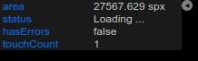

[](http://opensource.org/licenses/MIT)
UIStats (TypeScript and Javascript)

[ikaroskappler/uistats-typescript](https://github.com/IkarosKappler/uistats-typescript)
===================================

This is a tiny UI module for displaying simple stats data.

The whole production library is only 3.6kB.




[Interactive demo in a polygon App](https://www.int2byte.de/public/plotboilerplate/demos/27-polygon-intersection-greinerhormann/)

## Install
```bash
$ npm install uistats-typescript
```

Browserify
```js
var UIStats = require('uistats-typescript');
```

Browser
```html
<script src="dist/uistats.min.js"></script>
```

## Use
```typescript
...
const myStats = {
  area : 0.0,
  status : 'Loading ...',
  hasErrors : false,
  touchCount : 1
};

var uiStats = new UIStats( myStats );
myStats = uiStats.proxy;
uiStats.add( 'area' ).precision( 3 ).suffix(' spx');
uiStats.add( 'status' );
uiStats.add( 'hasErrors' );
uiStats.add( 'touchCount' );

// ... do your stuff ...

// When the stats members update, the change will immediately become
// visible in the UI component
myStats.area = calculateArea(...);
```

## Compatibility
Note that the library uses [Proxy](https://developer.mozilla.org/en-US/docs/Web/JavaScript/Reference/Global_Objects/Proxy)
which is [not supported by IE](https://caniuse.com/?search=Proxy).

Consider using a [polyfill](https://github.com/GoogleChrome/proxy-polyfill) in the case you need IE support.